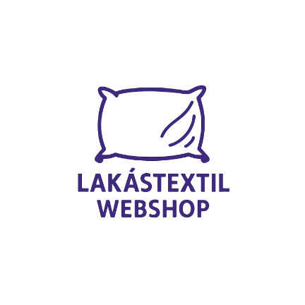
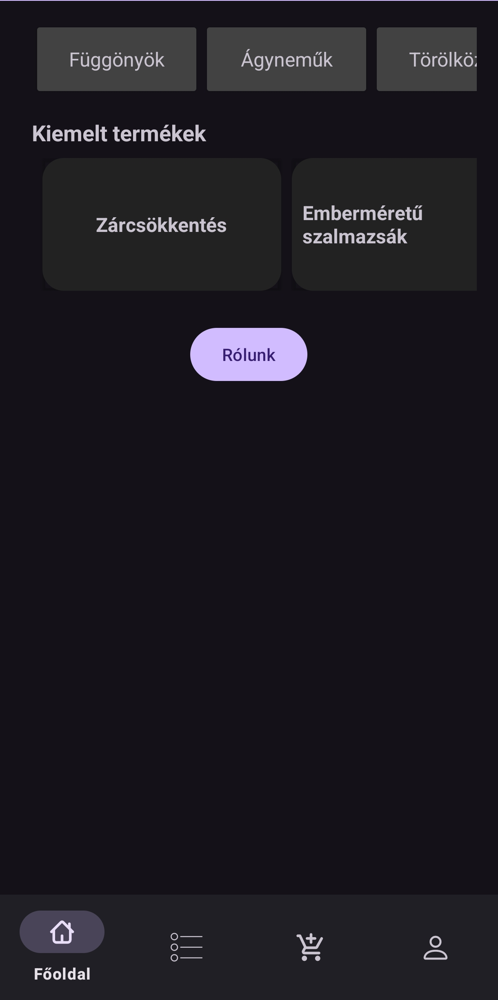
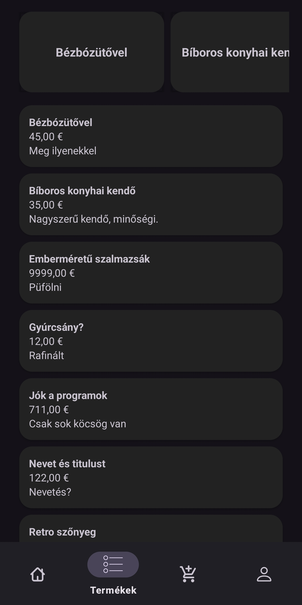
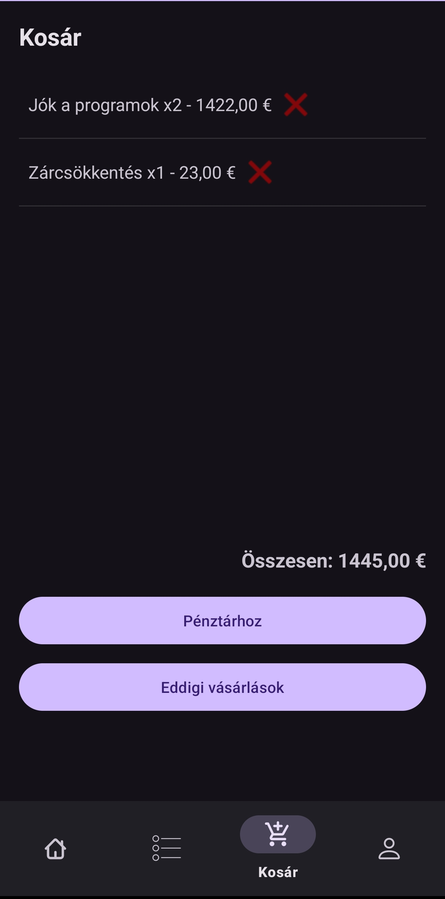
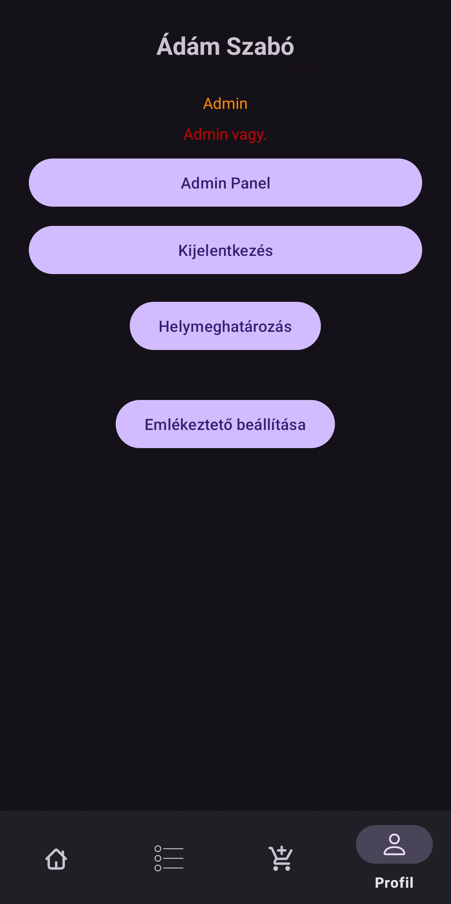

# 🧵 Lakástextil Webshop – Android alkalmazás

<p align="center">
    
</p>

Ez egy **Java nyelven** fejlesztett, natív **Android alkalmazás**, amely lehetővé teszi textiltermékek böngészését, vásárlását és adminisztrációját. A projekt célja egy modern, könnyen használható mobilalkalmazás létrehozása a textilkereskedelem támogatására.

---

## 📱 Funkciók

- 🛍️ **Termékek listázása, törlése, hozzáadása és frissítése**
- 🛒 **Kosárba rakás**
- ☁️ **Kosár mentése Firestore adatbázisba**
- 🧾 **Eddigi vásárlások megtekintése**
- 📍 **Helymeghatározás (lokáció lekérdezés)**
- ⏱️ **1 perces emlékeztető (alarm manager)**
- 🔔 **Értesítések megjelenítése vásárlás után**
- 👑 **Admin Panel (CRUD műveletek kezelése)**

---

## 🛠️ Fejlesztési környezet

- **Nyelv**: Java  
- **Fejlesztői környezet**: Android Studio  
- **Minimum SDK**: 29 
---

## 🔐 Admin jogosultság

Ha admin jogosultságra van szükséged (teljes CRUD lehetőségek), írj rám Discordon:  
**`adam_122`**

---

## 💡 Megjegyzés

> Kalkulustákon: A logika könnyű tárgy

---

## 📷 Képernyőképek

<div align="center">

<table>
  <thead>
    <tr>
      <th>Képernyő</th>
      <th>Előnézet</th>
    </tr>
  </thead>
  <tbody>
    <tr>
      <td><b>Kezdőképernyő</b></td>
      <td></td>
    </tr>
    <tr>
      <td><b>Terméklista</b></td>
      <td></td>
    </tr>
    <tr>
      <td><b>Kosár</b></td>
      <td></td>
    </tr>
    <tr>
      <td><b>Vásárlási előzmények</b></td>
      <td></td>
    </tr>
    <tr>
      <td><b>Profil</b></td>
      <td></td>
    </tr>
  </tbody>
</table>

</div>


## 📦 Telepítés

1. Klónozd a repót:
   ```bash
   git clone https://github.com/felhasznalonev/lakastextil-android.git
